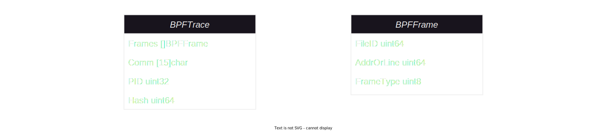

# Introduction

This repository implements a whole-system, cross-language profiler for Linux via
eBPF.

## Core features and strengths

- Implements the [experimental OTel profiling
  signal](https://github.com/open-telemetry/opentelemetry-proto/pull/534)
- Very low CPU and memory overhead (1% CPU and 250MB memory are our upper limits
  in testing and the agent typically manages to stay way below that)
- Support for native C/C++ executables without the need for DWARF debug
  information (by leveraging `.eh_frame` data as described in
  [US11604718B1](https://patents.google.com/patent/US11604718B1/en?inventor=thomas+dullien&oq=thomas+dullien))
- Support profiling of system libraries **without frame pointers** and **without
  debug symbols on the host**.
- Support for mixed stacktraces between runtimes - stacktraces go from Kernel
  space through unmodified system libraries all the way into high-level
  languages.
- Support for native code (C/C++, Rust, Zig, Go, etc. without debug symbols on
  host)
- Support for a broad set of HLLs (Hotspot JVM, Python, Ruby, PHP, Node.JS, V8,
  Perl), .NET is in preparation.
- 100% non-intrusive: there's no need to load agents or libraries into the
  processes that are being profiled.
- No need for any reconfiguration, instrumentation or restarts of HLL
  interpreters and VMs: the agent supports unwinding each of the supported
  languages in the default configuration.
- ARM64 support for all unwinders except NodeJS.
- Support for native `inline frames`, which provide insights into compiler
  optimizations and offer a higher precision of function call chains.

## Building

## Platform Requirements
The agent can be built with the provided make targets. Docker is required for containerized builds, and both amd64 and arm64 architectures are supported.

 For **Linux**, the following steps apply:
  1. Build the agent for your current machine's architecture:
     ```sh
     make agent
     ```
     Or `make debug-agent` for debug build.
  2. To cross-compile for a different architecture (e.g. arm64):
     ```sh
     make agent TARGET_ARCH=arm64
     ```
The resulting binary will be named <ebpf-profiler> in the current directory.

## Other OSes
Since the profiler is Linux-only, macOS and Windows users need to set up a Linux VM to build and run the agent. Ensure the appropriate architecture is specified if using cross-compilation. Use the same make targets as above after the Linux environment is configured in the VM.

## Alternative Build (Without Docker)
You can build the agent without Docker by directly installing the dependencies listed in the Dockerfile. Once dependencies are set up, simply run:
```sh
make
```
or
```sh
make debug
```
This will build the profiler natively on your machine.

## Running

You can start the agent with the following command:

```sh
sudo ./ebpf-profiler -collection-agent=127.0.0.1:11000 -disable-tls
```

The agent comes with a functional but work-in-progress / evolving implementation
of the recently released OTel profiling [signal](https://github.com/open-telemetry/opentelemetry-proto/pull/534).

The agent loads the eBPF program and its maps, starts unwinding and reports
captured traces to the backend.

## Agent internals

The host agent is a Go application that is deployed to all machines customers
wish to profile. It collects, processes and pushes observed stack traces and
related meta-information to a backend collector.

### Concepts

#### File IDs

A file ID uniquely identifies an executable, kernel or script language source
file.

File IDs for native applications are created by taking the SHA256 checksum of a
file's head, tail, and size, then truncating the hash digest to 16 bytes (128
bits):

```
Input  ← Concat(File[:4096], File[-4096:], BigEndianUInt64(Len(File)))
Digest ← SHA256(Input)
FileID ← Digest[:16]
```

File IDs for script and JIT languages are created in an interpreter-specific
fashion.

File IDs for Linux kernels are calculated by taking the FNV128 hash of their GNU
build ID.

#### Stack unwinding

Stack unwinding is the process of recovering the list of function calls that
lead execution to the point in the program at which the profiler interrupted it.

How stacks are unwound varies depending on whether a thread is running native,
JITed or interpreted code, but the basic idea is always the same: every language
that supports arbitrarily nested function calls needs a way to keep track of
which function it needs to return to after the current function completes. Our
unwinder uses that same information to repeatedly determine the caller until we
reach the thread's entry point.

In simplified pseudo-code:

```
pc ← interrupted_process.cpu.pc
sp ← interrupted_process.cpu.sp

while !is_entry_point(pc):
    file_id, start_addr, interp_type ← file_id_at_pc(pc)
    push_frame(interp_type, file_id, pc - start_addr)
    unwinder ← unwinder_for_interp(interp_type)
    pc, sp ← unwinder.next_frame(pc, sp)
```

#### Symbolization

Symbolization is the process of assigning source line information to the raw
addresses extracted during stack unwinding.

For script and JIT languages that always have symbol information available on
the customer machines, the host agent is responsible for symbolizing frames.

For native code the symbolization occurs in the backend. Stack frames are sent
as file IDs and the offset within the file and the symbolization service is then
responsible for assigning the correct function name, source file and lines in
the background. Symbols for open-source software installed from OS package repos
are pulled in from our global symbolization infrastructure and symbols for
private executables can be manually uploaded by the customer.

The primary reason for doing native symbolization in the backend is that native
executables in production will often be stripped. Asking the customer to deploy
symbols to production would be both wasteful in terms of disk usage and also a
major friction point in initial adoption.

#### Stack trace representation

We have two major representations for our stack traces.

The raw trace format produced by our BPF unwinders:

https://github.com/open-telemetry/opentelemetry-ebpf-profiler/blob/0945fe628da5c4854d55dd95e5dc4b4cf46a3c76/host/host.go#L60-L66

The final format produced after additional processing in user-land:

https://github.com/open-telemetry/opentelemetry-ebpf-profiler/blob/0945fe628da5c4854d55dd95e5dc4b4cf46a3c76/libpf/libpf.go#L458-L463

The two might look rather similar at first glance, but there are some important differences:

- the BPF variant uses truncated 64-bit file IDs to save precious kernel memory
- for interpreter frames the BPF variant uses the file ID and line number fields to store
  more or less arbitrary interpreter-specific data that is needed by the user-mode code to
  conduct symbolization

A third trace representation exists within our network protocol, but it essentially
just a deduplicated, compressed representation of the user-land trace format.

#### Trace hashing

In profiling it is common to see the same trace many times. Traces can be up to
128 entries long, and repeatedly symbolizing and sending the same traces over the
network would be very wasteful. We use trace hashing to avoid this. Different
hashing schemes are used for the BPF and user-mode trace representations. Multiple
64 bit hashes can end up being mapped to the same 128 bit hash, but *not* vice-versa.

**BPF trace hash (64 bit):**

```
H(kernel_stack_id, frames_user, PID)
```

**User-land trace hash (128 bit)**

```
H(frames_user_kernel)
```

### User-land sub-components

#### Tracer

The tracer is a central user-land component that loads and attaches our BPF
programs to their corresponding BPF probes during startup and then continues to
serve as the primary event pump for BPF <-> user-land communication. It further
instantiates and owns other important subcomponents like the process manager.

#### Trace handler

The trace handler is responsible for converting traces from the BPF format to
the user-space format. It receives raw traces [tracer](#tracer), converts them
to the user-space format and then sends them on to the [reporter](#reporter).
The majority of the conversion logic happens via a call into the process
manager's [`ConvertTrace`] function.

Since converting and enriching BPF-format traces is not a cheap operation, the
trace handler is also responsible for keeping a cache (mapping) of trace hashes:
from 64bit BPF hash to the user-space 128bit hash.

[`ConvertTrace`]: https://github.com/open-telemetry/opentelemetry-ebpf-profiler/blob/0945fe628da5c4854d55dd95e5dc4b4cf46a3c76/processmanager/manager.go#L208

#### Reporter

The reporter receives traces and trace counts in the user-mode format from the
[trace handler](#trace-handler), converts them to the gRPC representation and
then sends them out to a backend collector.

It also receives additional meta-information (such as [metrics](metrics/metrics.json) and [host metadata](hostmetadata/hostmetadata.json))
which it also converts and sends out to a backend collector over gRPC.

The reporter does not offer strong guarantees regarding reliability of
network operations and may drop data at any point, an "eventual consistency"
model.

#### Process manager

The process manager receives process creation/termination events from
[tracer](#tracer) and is responsible for making available any information to the
BPF code that it needs to conduct unwinding. It maintains a map of the
executables mapped into each process, loads stack unwinding deltas for native
modules and creates interpreter handlers for each memory mapping that belongs to
a supported language interpreter.

During trace conversion the process manager is further responsible for routing
symbolization requests to the correct interpreter handlers.

#### Interpreter handlers

Each interpreted or JITed language that we support has a corresponding type that
implements the interpreter handler interface. It is responsible for:

- detecting the interpreter's version and structure layouts
- placing information that the corresponding BPF interpreter unwinder needs into BPF maps
- translating interpreter frames from the BPF format to the user-land format by symbolizing them

#### Stack delta provider

Unwinding the stack of native executables compiled without frame pointers
requires stack deltas. These deltas are essentially a mapping from each PC in an
executable to instructions describing how to find the caller and how to adjust
the unwinder machine state in preparation of locating the next frame. Typically
these instructions consist of a register that is used as a base address and an
offset (delta) that needs to be added to it -- hence the name. The stack delta
provider is responsible for analyzing executables and creating stack deltas for
them.

For most native executables, we rely on the information present in `.eh_frame`.
`.eh_frame` was originally meant only for C++ exception unwinding, but it has
since been repurposed for stack unwinding in general. Even applications written
in many other native languages like C, Zig or Rust will typically come with
`.eh_frame`.

One important exception to this general pattern is Go. As of writing, Go
executables do not come with `.eh_frame` sections unless they are built with CGo
enabled. Even with CGo the `.eh_frame` section will only contain information for
a small subset of functions that are either written in C/C++ or part of the CGo
runtime. For Go executables we extract the stack delta information from the
Go-specific section called `.gopclntab`. In-depth documentation on the format is
available in [a separate document](doc/gopclntab.md)).

### BPF components

The BPF portion of the host agent implements the actual stack unwinding. It uses
the eBPF virtual machine to execute our code directly in the Linux kernel. The
components are implemented in BPF C and live in the
[`opentelemetry-ebpf-profiler/support/ebpf`](./support/ebpf) directory.

#### Limitations

BPF programs must adhere to various restrictions imposed by the verifier. Many
of these limitations are significantly relaxed in newer kernel versions, but we
still have to stick to the old limits because we wish to continue supporting
older kernels.

The minimum supported Linux kernel versions are
- 4.19 for amd64/x86_64
- 5.5 for arm64/aarch64

The most notable limitations are the following two:

- **4096 instructions per program**\
  A single BPF program can consist of a maximum of 4096 instructions, otherwise
  older kernels will refuse to load it. Since BPF does not allow for loops, they
  instead need to be unrolled.
- **32 tail-calls**\
  Linux allows BPF programs to do a tail-call to another BPF program. A tail
  call is essentially a `jmp` into another BPF program, ending execution of the
  current handler and starting a new one. This allows us to circumvent the 4096
  instruction limit a bit by doing a tail-call before we run into the limit.
  There's a maximum of 32 tail calls that a BPF program can do.

These limitations mean that we generally try to prepare as much work as possible
in user-land and then only do the minimal work necessary within BPF. We can only
use $O(\log{n})$ algorithms at worst and try to stick with $O(1)$ for most things.
All processing that cannot be implemented like this must be delegated to
user-land. As a general rule of thumb, anything that needs more than 32
iterations in a loop is out of the question for BPF.

#### Unwinders

Unwinding always begins in [`native_tracer_entry`]. This entry point for our
tracer starts by reading the register state of the thread that we just
interrupted and initializes the [`PerCPURecord`] structure. The per-CPU record
persists data between tail-calls of the same unwinder invocation. The unwinder's
current `PC`, `SP` etc. values are initialized from register values.

After the initial setup the entry point consults a BPF map that is maintained
by the user-land portion of the agent to determine which interpreter unwinder
is responsible for unwinding the code at `PC`. If a record for the memory
region is found, we then tail-call to the corresponding interpreter unwinder.

Each interpreter unwinder has their own BPF program. The interpreter unwinders
typically have an unrolled main loop where they try to unwind as many frames for
that interpreter as they can without going over the instruction limit. After
each iteration the unwinders will typically check whether the current PC value
still belongs to the current unwinder and tail-call to the right unwinder
otherwise.

When an unwinder detects that we've reached the last frame in the trace,
unwinding is terminated with a tail call to [`unwind_stop`]. For most traces
this call will happen in the native unwinder, since even JITed languages
usually call through a few layers of native C/C++ code before entering the VM.
We detect the end of a trace by heuristically marking certain functions with
`PROG_UNWIND_STOP` in the BPF maps prepared by user-land. `unwind_stop` then
sends the completed BPF trace to user-land.

If any frame in the trace requires symbolization in user-mode, we additionally
send a BPF event to request an expedited read from user-land. For all other
traces user-land will simply read and then clear this map on a timer.

[`native_tracer_entry`]: https://github.com/open-telemetry/opentelemetry-ebpf-profiler/blob/0945fe628da5c4854d55dd95e5dc4b4cf46a3c76/support/ebpf/native_stack_trace.ebpf.c#L875
[`PerCPURecord`]: https://github.com/open-telemetry/opentelemetry-ebpf-profiler/blob/0945fe628da5c4854d55dd95e5dc4b4cf46a3c76/support/ebpf/types.h#L576
[`unwind_stop`]: https://github.com/open-telemetry/opentelemetry-ebpf-profiler/blob/0945fe628da5c4854d55dd95e5dc4b4cf46a3c76/support/ebpf/interpreter_dispatcher.ebpf.c#L125

#### PID events

The BPF components are responsible for notifying user-land about new and exiting
processes. An event about a new process is produced when we first interrupt it
with the unwinders. Events about exiting processes are created with a
`sched_process_exit` probe. In both cases the BPF code sends a perf event to
notify user-land. We also re-report a PID if we detect execution in previously
unknown memory region to prompt re-scan of the mappings.

### Network protocol

All collected information is reported to a backend collector via a push-based,
stateless, one-way gRPC [protocol](https://github.com/open-telemetry/opentelemetry-proto/pull/534).

All data to be transmitted is stored in bounded FIFO queues (ring buffers). Old
data is overwritten when the queues fill up (e.g. due to a lagging or offline
backend collector). There is no explicit reliability or redundancy (besides
retries internal to gRPC) and the assumption is that data will be resent
(eventually consistent).

### Trace processing pipeline

The host agent contains an internal pipeline that incrementally processes the
raw traces that are produced by the BPF unwinders, enriches them with additional
information (e.g. symbols for interpreter frames and container info), deduplicates
known traces and combines trace counts that occurred in the same update period.

The traces produced in BPF start out with the information shown in the following
diagram.

<details>
<summary>Note: please read this if you wish to update the diagrams</summary>

The diagrams in this section were created via draw.io. The SVGs can be loaded
into draw.io for editing. When you're done, make sure to export via
<kbd>File</kbd> -> <kbd>Export As</kbd> -> <kbd>SVG</kbd> and then select
a zoom level of 200%. If you simply save the diagram via <kbd>CTRL+S</kbd>,
it won't fill the whole width of the documentation page. Also make sure that
"Include a copy of my diagram" remains ticked to keep the diagram editable.

</details>



Our backend collector expects to receive trace information in a normalized and
enriched format. This diagram below is relatively close to the data-structures
that are actually sent over the network, minus the batching and domain-specific
deduplication that we apply prior to sending it out.


The diagram below provides a detailed overview on how the various components of
the host agent interact to transform raw traces into the network format. It
is focused around our data structures and how data flows through them. Dotted
lines represent indirect interaction with data structures, solid ones correspond
to code flow. "UM" is short for "user mode".


### Testing strategy

The host agent code is tested with three test suites:

- **Go unit tests**\
  Functionality of individual functions and types is tested with regular Go unit
  tests. This works great for the user-land portion of the agent, but is unable
  to test any of the unwinding logic and BPF interaction.
- **coredump test suite**\
  The coredump test suite (`tools/coredump`) we compile the whole BPF unwinder
  code into a user-mode executable, then use the information from a coredump to
  simulate a realistic environment to test the unwinder code in. The coredump
  suite essentially implements all required BPF helper functions in user-space,
  reading memory and thread contexts from the coredump. The resulting traces are
  then compared to a frame list in a JSON file, serving as regression tests.
- **BPF integration tests**\
  A special build of the host agent with the `integration` tag is created that
  enables specialized test cases that actually load BPF tracers into the kernel.
  These test cases require root privileges and thus cannot be part of the
  regular unit test suite. The test cases focus on covering the interaction and
  communication of BPF with user-mode code, as well as testing that our BPF code
  passes the BPF verifier. Our CI builds the integration test executable once and
  then executes it on a wide range of different Linux kernel versions via qemu.

### Probabilistic profiling

Probabilistic profiling allows you to reduce storage costs by collecting a representative
sample of profiling data. This method decreases storage costs with a visibility trade-off,
as not all Profiling Host Agents will have profile collection enabled at all times.

Profiling Events linearly correlate with the probabilistic profiling value. The lower the value,
the fewer events are collected.

#### Configure probabilistic profiling

To configure probabilistic profiling, set the `-probabilistic-threshold` and `-probabilistic-interval` options.

Set the `-probabilistic-threshold` option to a unsigned integer between 1 and 99 to enable
 probabilistic profiling. At every probabilistic interval, a random number between 0 and 99 is chosen.
 If the probabilistic threshold that you've set is greater than this random number, the agent collects
 profiles from this system for the duration of the interval. The default value is 100.

Set the `-probabilistic-interval` option to a time duration to define the time interval for which
probabilistic profiling is either enabled or disabled. The default value is 1 minute.

#### Example

The following example shows how to configure the profiling agent with a threshold of 50 and an interval of 2 minutes and 30 seconds:
```bash
sudo ./ebpf-profiler -probabilistic-threshold=50 -probabilistic-interval=2m30s
```

# Legal

## Licensing Information

This project is licensed under the Apache License 2.0 (Apache-2.0).
[Apache License 2.0](LICENSE)

The eBPF source code is licensed under the GPL 2.0 license.
[GPL 2.0](support/ebpf/LICENSE)

## Licenses of dependencies

To display a summary of the dependencies' licenses:
```sh
make legal
```
