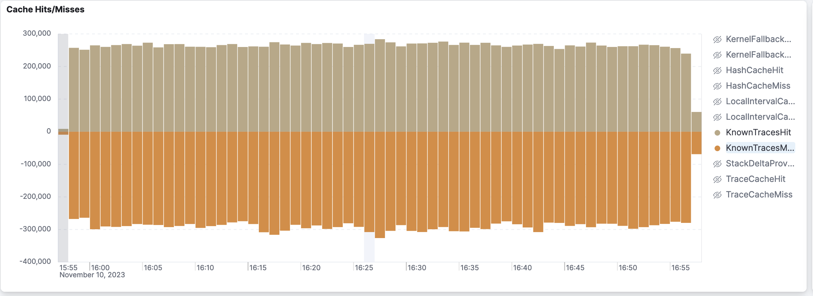
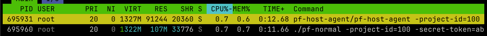
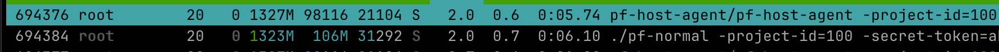
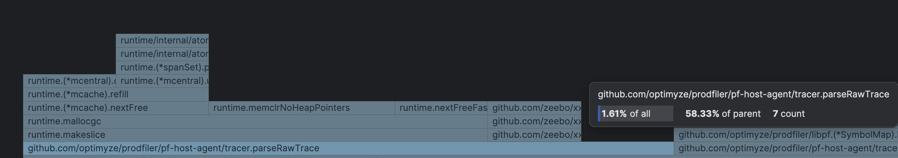

> [!IMPORTANT]
>
> This document is from Elastic times and precedes the open-sourcing of the
> profiling agent. It is provided as an example of what a design document
> could look like. Many of the links had to be removed because the original
> git history of the profiling agent had to be erased for legal reasons when
> it was open-sourced.

HA: remove BPF hashing
======================

# Meta

- **Author(s)**: Joel Höner
- **Start Date**: 9. Nov 2023
- **Goal End Date**: 5. Dec 2023
- **Primary Reviewers**: Christos Kalkanis, Timo Teräs

## Abstract

Our host agent uses a relatively complex data processing pipeline that enriches,
aggregates and reshapes raw traces into the format expected by the collector.
Statistics show that a significant portion of this complexity might be
unwarranted. Upcoming features further change some important requirements for
the system as a whole. This document proposes a rapid simplification of the
BPF ↔ user-mode communication portion of the pipeline.

## Context

The relevant portion of our trace aggregation in the host agent currently looks
roughly like this:


> [!NOTE]
>
> Kernel stack transfer is not included here because it will remain unchanged.

## Problem

The BPF and `tracehandler` portions of this pipeline are complex pieces
of code that have already cost multiple engineers a lot of time to reason about
whenever they need to be changed.

The majority of the complexity arises from the fact that our BPF code transfers
traces and counts separately, but `tracehandler` needs to transfer information
from the trace over to the count updates that it sends out. The count updates from
BPF are essentially just `(BPFHash, Count)` tuples, but `reporter` expects count
updates to be annotated with thread-, container- and pod name. BPF sends the
information required to infer these values with the trace instead of the count.

For `tracehandler` this means that it has to keep a cache of `(BPFHash,
TraceMeta)` mappings in order to make sure that it always has the required
information for the outgoing count updates. Moreover, it cannot make any
assumptions about the trace info already being present when corresponding counts
arrive, so it must support deferring count updates until the trace info for them
arrives.

BPF currently uses 5 different BPF maps with different lifetimes and aggregation
behaviors. Maintaining the cache from `BPFHash` to `TraceMeta` further needs to
be implemented very efficiently to not eat up too much memory, so we're
currently using a hand-rolled, domain-specific LRU implementation for this.
This all adds up to a non-trivial amount of complexity.

Another problem with this approach is that all information that is present in
the trace must also be part of the BPF hash. This in turn means that every
high-cardinality field that we add to the trace diminishes the efficiency of the
aggregation that occurs in the BPF maps.

### Aggregation is rare already

Testing with real-world applications has shown that it's pretty rare for an
entry in `hash_to_count` to ever have a count >1 within the 5 second interval
that we use for the BPF ↔ user-mode communication. Inserting into and removing
from a hash map is quite a bit more work than simply sending a perf event that
is mmap'ed into user-land. Particularly for traces with the "symbolize this now"
flag this is currently rather wasteful because we even send an additional perf
event to force the map to be read and cleared immediately.

Trace resends via `hash_to_trace` are additionally suppressed via the
`known_traces` map that is tethered to `hashMapperCache` in `tracehandler`. This
suppresses the resend for ~45% of traces. We can monitor this rate for all
profiling agent deployments globally:



While ~45% might seem like a significant chunk on first glance, any caching
scheme must always be evaluated in the context of:

- what the cost of just redoing the work all the time would be
- the number of cycles burned in vain on the cache lookup itself when cache misses occur
- the cost of maintaining the cache

The complex system with traces being split across multiple maps is in place in
large parts **just to support this caching scheme**, and without it we could go
with a much simpler approach (detailed in ["Proposed
Solution"](#proposed-solution)).

In this simpler scheme, the cost of just resending the whole trace is a 0.3 -
2.5 KiB `memcpy` and, for a percentage of traces, a syscall to fetch the kernel
portion of the trace. The cache lookup in the existing system involves two
passes through hashing functions[^2] that will in all likelihood be slower than
an actual `memcpy`[^3], though perhaps not slower than a syscall.

With that context in mind, ~45% aren't really all that good anymore. In 55% of
cases we will pay the price of the hashing **plus** the cost of sending the
trace.

[^2]: First our custom hashing function, then putting the hash through whatever
      hash function the kernel uses for their hash maps.
[^3]: Even heavily SIMDed hash functions like XXH3 are typically [quite a bit
      slower] than a `memcpy`, and our custom hash function is very basic scalar
      code. Also see ["Cost of memcpy" section](#cost-of-memcpy).

[quite a bit slower]: https://github.com/rurban/smhasher

### Upcoming features

There are two upcoming features that may increase the cardinality of the BPF
trace significantly. Increased cardinality in turn further reduces the chance of
two traces being aggregated under one BPF hash.

#### Nanosecond timestamps

Christos' planned change towards nanosecond precision timestamps will require
recording the timestamp in kernel-mode. Previously the timestamp was not part of
the BPF trace and was added once it arrived in user-mode. This worked reasonably
well for second precision timestamps, but will definitely not transfer to
nanosecond precision.

Assuming that we'd implement that by adding a timestamp field to the trace
and included that in the trace, this will almost guarantee that every BPF trace
is now be unique for all but a synthetic load that puts all cores into an
infinite loop.

For this particular problem, there's an alternative route where we'd switch
`hash_to_count` to a per-CPU `nanotime_to_hash` map and let user-space do
aggregation/counting of events (in this case, hashes). This is what Christos
actually prototyped. This requires fewer changes at the cost of adding more
complexity to the existing system.

#### APM integration

We're currently working on integration between the APM and profiling products.
To allow associating profiling traces with APM traces, we need to read the APM
transaction-, span-, and trace IDs that were active while we collected each
trace.

The APM IDs are randomly generated and particularly the spans and their IDs
typically only last for a few milliseconds. This is thus very similar to the
problem with the nanosecond timestamps: if we just include them in the BPF trace
hash, that will make it exceedingly unlikely that any aggregation takes place.

Other than with the nanosecond precision timestamps, this problem will only
affect deployments that actually use the APM integration feature.

## Success Criteria

The primary goal is to unlock adding new high-cardinality fields to the trace in
the future without too much effort and without having to worry about constantly
deteriorating performance with every added field.

A secondary goal is to achieve the primary goal without adding even more
complexity. In fact, preferably we use the opportunity to shed some.

The changes further cannot put the host agent over the 1% CPU usage barrier.

## Scope

In scope:

  - trace processing in BPF, tracer, and tracehandler

Not in scope:

  - any breaking changes to the reporter or the network protocol
  - changing the user mode hash (tackled in separate document)
  - experiments with per-frame (instead of per-trace) caching

## Proposed Solution

Remove BPF hashing and aggregation entirely and just resend the whole trace in a
perf event or BPF ring buffer for every sample that we unwind.

Because with this approach all information is directly present in the event,
`tracehandler` no longer needs to keep a mapping from BPF hashes to trace meta
information. Worries about whether traces or counts arrive first become
irrelevant. `tracehandler`'s job is essentially reduced to just keeping track of
which traces were already previously reported to the collector and splitting
counts and traces.

The caches that still need to be kept are reduced to:

- `bpfTraceCache: BPFHash → UMHash`
  - Suppresses unnecessary trace conversion
  - Roughly comparable to the previous `hashMapperCache` (and `known_traces`)
  - Pure performance optimization: not actually strictly required with this approach
- `umTraceCache: UMHash → Void`
  - Suppress trace resend to the collector
  - Equivalent to previous `traceCache`

The following diagram shows the portion of the trace aggregation pipeline that
was previously introduced in the ["Context"](#context) section, but with the
suggested changes applied.


### Kernel memory napkin math

Some basic math on this suggests that we'll actually need significantly less
kernel memory to be able to keep the same amount of traces in memory as with the
current approach.

The following uses the map sizes that the host agent dynamically allocated on my
10 core VM. The buffers in both implementations should scale linearly with the
number of cores, so the concrete core counts do not impact the ratio between
both approaches.

<center>

| Map               | Key Size | Value Size | # Entries |
| ----------------- | -------- | ---------- | --------- |
| hash_to_framelist | 16       | 272        | 0x4000    |
| hash_to_trace     | 8        | 40         | 0x800     |
| hash_to_count     | 8        | 4          | 0x800     |
| known_traces      | 8        | 1          | 0x10000   |

</center>

```
(16+272)*0x4000
   + (8+40)*0x800
   + (8+4)*0x800
   + (8+1)*0x10000
   ≈ 5304 KiB
```

> [!NOTE]
>
> The above ignores the per-record memory overhead that the individual data
> structures have. For example the hash map will have to store the hashes
> somewhere, so the actual memory overhead  will likely be a bit higher than
> calculated here.

With the proposed solution, we only have one map.

| Map          | Key Size | Value Size             | # Entries                          |
| ------------ | -------- | ---------------------- | ---------------------------------- |
| trace_events | 0        | `sizeof(Trace)` = 2216 | `ncpu * freq * max_buf_secs` = 200 |

```
2216 * 200 ≈ 432 KiB
```

The above selects the buffer size to allow storing traces of maximum length with
all cores maxed out for 1 second. I expect that we'll read the buffers multiple
times per second to ensure timely interpreter symbolization, so this should be a
reasonable amount of slack to overcome small system hick-ups. We could also
easily ensure space for a 5 second period and still stay way below the current
memory footprint.

### Proof of Concept

During my OnWeek project in Oct 2023 I prototyped the proposed approach on the
[`joel/no-bpf-hashes`] branch and the results look quite promising. It looks
like we can achieve the same or better performance than the existing approach
while at the same time getting rid of a major piece of complexity. The prototype
also still works on our oldest supported kernel version (Linux 4.15).

The diff stats for the prototype currently look like this:

```
Showing 26 changed files with 283 additions and 3,179 deletions.
```

In the process I however also discovered some challenges that we'll discuss
in the following section.

[`joel/no-bpf-hashes`]: #

## Detailed change proposals

### Abolish hash maps, embrace ring buffers

This is the core of this design document: I suggest that we stop hashing traces
in BPF and instead resend both meta information and the frame list for every
event. This eliminates the need for the `hash_to_count`, `hash_to_trace` and
`known_traces` maps. The existing `report_events` that is currently used for
both communicating PID events and forcing immediate map reads in UM (via
`ha_symbolization_needed`) will now only be concerned with PID events. All that
we need is one new perf event buffer `trace_events` that all trace events are
sent through:

`<code block embedding removed: git history no longer exists>`

Perf events are essentially per-CPU ring-buffers. The events don't have to be
copied into user-mode memory: the ring buffer is `mmaped` into the UM
process[^1].

Since we're currently only suppressing about 45% of trace resends anyway, we
don't expect the overhead of this to be massive. Hashing and splitting the trace
across multiple hash maps is definitely more expensive than just sending a perf
event. With the existing system we are paying the price of caching itself plus
the price of resending the trace for the 55% of cases where the cache is missed.

[^1]: [`perf_event_open`] manual page, CTRL+F for "MMAP layout" headline

[`perf_event_open`]: https://www.man7.org/linux/man-pages/man2/perf_event_open.2.html

I was originally worried that copying the events to Go heap and the
corresponding GC pressure would be an issue, but testing with the prototype
shows that this was unwarranted: the corresponding code barely shows up in the
profiler (see ["Cost of memcpy" section](#cost-of-memcpy)).

We're also doing 45% more syscalls to retrieve the kernel half of our traces
with the new approach. Just like the `memcpy`, this also largely turned out to
be a non-issue: in the prototype we only spend about 0.92% of CPU cycles on this
([pprof profile](./prototype-option-2-ghidra-workload.pprof)). This is likely at
least in part because only a fraction of traces actually have kernel traces
associated with them.

What did turn out to be an issue, however, is that we're now waking user-mode a
lot more frequently than we used with the old approach. The old HA only forces
an immediate read in UM when:

- the trace is not previously known. This eliminates about ~45% of wakes.
- the unwinder sets `ha_symbolization_needed`. This eliminates 100% of wakes
  that aren't due to PID events in a pure native workload and a noticeable chunk
  in mixed workloads.

This essentially means that we're waking from our `epoll` call that waits for
perf events a lot more frequently than before. The kernel itself seems to be
pretty good at handling this kind of wake efficiently, but the Go runtime isn't.
With all other optimizations suggested in this document (minus the ones in the
following "options" sections) applied, this almost doubles the CPU time that the
host agent is consuming in the average case. For interpreter workloads the
difference is not so significant. In the profile we're observing a slight (but
by no means deal-breaking) increase of time spent in `epoll` and a massive
increase of time spent in the goroutine scheduler.

There are a number of possible routes that we can pursue to reduce the overhead
from constant waking. We'll discuss each one in the following sub-sections.

> [!IMPORTANT]
>
> We recently learned that there is a bug with event inhibition that causes
> the "symbolize this now" events to not actually be delivered as intended.
>
> This likely explains why the previous approach was more performant even in
> heavy interpreter workloads despite the fact that the new approach should
> intuitively perform better here: constantly reading and clearing multiple maps
> really shouldn't be faster than reading events from shared memory and bumping
> atomics. Under a heavy interpreter load the amount of waking should be about
> the same between both variants if inhibition is released correctly.
>
> We did some experiments and confirmed that fixing the issue to restore the
> code's intended behavior indeed increases CPU usage significantly. However, we
> also noticed that interpreter symbolization clearly worked pretty well
> **despite this being broken for years now**, so we converged towards simply
> keeping the inhibition bug in place for the moment.

#### Option 1: perf event buffer with event counting watermarks

Perf event buffers support a feature called "watermarks". This essentially
allows us to specify a minimum number of either events or bytes in the buffer
before `epoll` will wake our process. Cilium defaults this to "1 byte". Setting
up watermarks to a size where they only wake us about 4 times per second per
core when all cores are maxed eliminates the overhead entirely.

However, there are some issues with this approach that we'd need to get around:

1) **The frequency at which we read events becomes unpredictable.**\
   On a system that is almost completely idle, it might take minutes to ever
   reach the watermark. If a user opts out of fair scheduling by pinning their
   application to a fixed list of cores, the frequency will also vary from core
   to core.
2) **Cilium's BPF library only supports the byte-based watermarks.**\
   The length of our trace event can vary wildly depending on workload, so a
   byte-size based watermark intensifies problem 1 even more: the reporting
   frequency will additionally depend on the stack trace length.

We can get around this by:

1) **teaching Cilium to use the watermark variant that counts events.**\
   I have already implemented this to make sure that the kernel actually accepts
   it with the BPF event kind. It's only a few lines of diff and works as expected.
   It should be easy to get this merged upstream if we want.
2) **sending empty dummy traces when we interrupted the idle process.**\
   It's easy to forget that we have that option because we generally tend to
   think of our BPF code as only being invoked when the CPU is under load, but
   that is not actually the case. We get called at a constant frequency
   regardless of the workload; we just immediately bail out when we [detect that
   we're in the idle process][idle-check]. We could change this code path to
   always send an empty dummy record and thus ensure that our watermark is
   reached in a predictable and timely manner.

[idle-check]: #

#### Option 2: polling the perf event buffer

The Cilium BPF library currently [always does an `epoll`][cilium-epoll] to get
notified about whether a watermark has been reached before attempting to read
from the ring. However, this is not actually required to safely read from the
buffer: it's also perfectly sound to just try to read and see if it contains
some data. Data access is synchronized with atomics. The Rust BPF library, for
example, supports this (and in fact offers it as the default way).

Cilium currently doesn't provide a function to do that, but we can quite easily
add one. All the error prone logic for correctly reading and updating the
atomics is in place already;we mostly just need to call their existing
functions without doing an epoll first. I also implemented that variant in the
prototype and it works great. This in turn allows us to just read from our perf
event buffers at a constant frequency.

The drawback here is that we're paying a certain constant overhead from polling.
However, in my experiments with a 250ms polling frequency, this is essentially
negligible. On the positive side, the HA CPU usage will be very consistent
regardless of the workload.

I measured this to be ever so slightly slower than the current regular host agent
on a completely idle system (~32 minutes wall time):



And a bit more efficient on a system under a heavy mixed HotSpot/native workload
(~5 minutes wall time):



`pf-host-agent` is the prototype HA, `pf-normal` is a HA built from latest
`main` as of writing. Ignore the CPU percentage and look at the core seconds
under "TIME+". One additional core second in 32 minutes of wall time in the idle
case seems perfectly acceptable to me.

[cilium-epoll]: https://github.com/cilium/ebpf/blob/da24e832beede03ec73966c7b92748d370c1937d/perf/reader.go#L354C7-L354C7

#### Option 3: option 2 + 80% watermarks

We could extend option 2 by additionally setting a very high byte-based
watermark (e.g. 80% of the buffer size) and additionally `epoll` on that to
ensure that our buffer doesn't run full while we are sleeping between timer
ticks. This would potentially allow us to use a much smaller perf event buffer
while still having relatively high confidence that it never runs over while we
are sleeping.

#### Option 4: BPF ring buffers

While perf event buffers have one ring buffer per core, BPF ring buffers are
shared between all cores. This has the obvious benefit that user-mode will
always just have to manually poll a single mmap'ed ring or `epoll` on a single
file descriptor (instead of `num_cpu` FDs). This is beneficial for both
approaches: the overhead is constant and doesn't linearly scale with core count
as it does with perf event buffers.

BPF ring buffers further allow the BPF code to decide whether it wants to wake
user-land on each message sent via `BPF_RB_NO_WAKEUP` and `BPF_RB_FORCE_WAKEUP`
flags. It can further query the buffer fill status via `bpf_ringbuf_query`. This
essentially allows us to implement whatever custom waking schema that we want,
and later switching or refining the approach would be quite easy.

The drawback here is that BPF ring buffers were only added in kernel 5.8. I ran
a few queries on our HA metrics cluster and we still have about 3% of customers
running kernels that are older than that. It's further possible that certain
features (like waking and inspecting the buffer state from BPF) were added in
even newer kernel versions. If there is reviewer preference towards exploring
this approach further, I'd be happy to research this in more detail.

#### Option 5: option 2 or 4 + early wakes for interpreter frames

Option 2 and 4 can both optionally be extended to allow for early wake-ups that
ensure timely user-mode symbolization of interpreter frames. Examples for factors
that might request an early read could be (simply quoting Timo's suggestions):

- if it's long living process, and we know the VM is unlikely to overwrite
  memory structures, we could just throttle to send this event once every few
  seconds per PID at maximum
- if it's new process, or the VM is known to be potentially overwriting things,
  wakeup every frame as needed
- have per-VM type, or per-{PID,framedata} LRU to throttle sending the wakeup

**With option 2** we'd simply have to leave the old "send an event to the PID
event perf buffer for early flush" mechanism in place. Instead of flushing the
old BPF hash maps it'd cause an early read of the perf event buffers.

**With option 4** we could set the flag argument on `bpf_ringbuf_output` to
`BPF_RB_FORCE_WAKEUP` to force a wake-up in user-mode.

#### Author's preference

My preference is option 2. Option 3 and 5 can be considered optional
improvements to option 2 that we may or may not apply later.

Option 1 seems like a bit of a hack that introduces mental complexity while
providing no upside at all compared to option 2.

Option 4 is also excellent and what I'd like to see us using in the future, but
I'm not sure whether we're willing to kick out 3% of customers. I suspect that
we'll discover that particularly the big corporate customers that are waiting
for on-prem might be running older kernels.

Starting with option 2 now and migrating to option 4 maybe a year down the line
should not present a huge amount of work, so this is my preference.

#### Decision

Reviewers agreed with the author's preference.

### Replace `hashmapperlru` with `freelru`

The hand-rolled `hashmapperlru` mostly exists because we had to persistently
store various string fields (comm, pod name, container name) of the trace that
need to be transferred over to the count updates while maintaining high memory
efficiency with string interning.

The remaining LRUs in `tracehandler` no longer need to store any strings or
other heap allocated objects: both keys and values are either just hashes or
`libpf.Void`. Since we always just resend everything in the new approach,
there's also no chance that we'll ever have to add back any such field in the
LRU when we add more fields later.

Pod and container name are currently still part of the UM hash. They are not
sent from kernel directly, but derived from the PID. Since the names cannot
change after process start, there is no need to worry about them changing
and having to invalidate caches because of that.

We can thus retire our complicated custom LRU implementation and replace it with
the generic `freelru` without sacrificing memory efficiency.

**Validated in prototype:** yes\
**Independent issue:** no

### Frame list in `per_cpu_record`

During unwinding the frame list is currently chunked and temporarily stored in
the dedicated BPF map `per_cpu_frame_list`:

`<code block embedding removed: git history no longer exists>`

I honestly have no idea why we are doing this even in the current approach: it
adds quite a bit of complexity to both the "push" function and the trace hashing
code. As far as I can tell there doesn't seem to be any technical limitation
that would require this chunking even on old kernels.

I suggest that we simply add the frame list to our existing [`Trace`] struct, in
struct-of-array columnar representation:

```c
typedef struct Trace {
   // [...] (existing meta-data fields omitted)

   struct {
      FileID file_ids[MAX_FRAME_UNWINDS];
      u64 addr_or_lines[MAX_FRAME_UNWINDS];
      u8 kinds[MAX_FRAME_UNWINDS];
   } frames;
} Trace;
```

Columnar representation is chosen to reduce alignment bytes. The alternative of
an `__attribute__((packed))` `Frame` type and array-of-struct was considered,
but turned out to not be supported by CGo: it ignores the attribute and ends up
accessing memory incorrectly.

The `Trace` instances live in [`PerCPURecord`] and was previously already used
to store trace meta-information. The proposed change thus simply consolidates
the two maps into one.

**Validated in prototype:** yes\
**Independent issue:** yes, but simpler to do in main PR

[`Trace`]: #
[`PerCPURecord`]: #

### Move container- and pod name lookup into `tracehandler`

The lookup for container- and pod names currently happens in
`ProcessManager.ConverTrace`:

`<code block embedding removed: git history no longer exists>`

The BPF trace only contains the PID, not the actual container- and pod name. To
have both of these available when sending out the count, we thus need to move
the lookup to `tracehandler`. `tracehandler` can then pass the names that it
looked up to `ConvertTrace` for new traces and skip trace conversion for known
ones.

**Validated in prototype:** yes\
**Independent issue:** no

### Extended container- and pod name caching

Moving the call to tracehandler means that we'll now be doing these lookups more
often than before. Previously we'd only call into `containermetadata` when a
trace wasn't present in `hashMapperCache` and needed conversion, now we'll be
doing it for every trace.

`containermetadata` has caching in place already:

`<code block embedding removed: git history no longer exists>`

But that cache is only hit after looking up the file identifier. The `Sprintf`
and the `stat` syscall originating in `libpf.GetOnDiskFileIdentifier` eat a
noticeable amount of CPU time.

It wasn't immediately obvious to me why this indirection via the file identifier
is taken instead of simply using the PID as the key, but the [comments on the PR
that added the cache][pid-reuse] shed light on that: it's meant to provide
resilience against PID reuse.

We essentially have three options here:

1) Accept a slight increase in cycles burned: about 3-5%.
2) Add a second, short lived `PID → (PodName, ContainerName)` cache in
   `tracehandler`. This is the route that I pursued in the prototype. A 256
   entry cache with a lifetime of 1 minute did the job.
3) Reduce resilience against PID reuse and change the key of the existing cache
   to be PID based, but add a timeout on the LRU.

**Author's preference:** I'd like to give option 3 a try: I suspect that it
should do the job nicely without the need for added complexity from a new layer
of caching. No strong opinion on this, though.

**Validated in prototype:** yes (option 1 and 2)\
**Independent issue:** yes

[pid-reuse]: #

#### Improvements on newer kernels

Kernel versions v4.18+ actually have a function `bpf_get_current_cgroup_id` that
we could use to obtain a unique ID that is guaranteed not to be re-used:

https://github.com/torvalds/linux/blob/9b6de136b5f0158c60844f85286a593cb70fb364/include/linux/kernfs.h#L217-L221

I believe the inode ID corresponds to the directory node in `/sys/fs/cgroup`. To
my knowledge there is no way to open a file descriptor from an inode ID, so we'll
still have to keep our existing logic based on PIDs to read the container info.
The ID could only serve as a better cache key.

### BPF trace hashing in UM

#### Hash inputs

We're no longer hashing traces within BPF, but we still need to construct a hash
for the LRU that suppresses repeated trace conversion. However, if we continue
to just have all fields of the BPF trace into this, we'll suffer the same
diminishing returns of caching efficiency with every high-cardinality field that
we add as discussed in the [Problems](#problems) section.

Since the purpose of the hash is now only to avoid repeatedly doing user-mode
symbolization for the same trace (and no longer to keep a unique mapping to
other existing and upcoming meta-fields like NS timestamp or APM info), we can
reduce the hash input to just the frame list, COMM, kernel stack ID, and PID.
The PID still needs to be included because the frame list can contain per-PID
identifiers.

**Validated in prototype:** no\
**Independent issue:** no (unless we start without a trace translation cache)

#### Hash algorithm

BPF is currently using a hand-rolled, custom hashing scheme. The scheme was
chosen primarily for simplicity and is likely neither the fastest, nor the most
collision resistant function imaginable. We already have XXH3 as a dependency
anyway, so I suggest that we just use that. It's very fast and provides a pretty
reasonable output distribution.

**Validated in prototype:** yes\
**Independent issue:** no (unless we start without a trace translation cache)

### Row-based trace record in UM

We're currently using a columnar (struct of array) representation for the frames
in `host.Trace`:

`<code block embedding removed: git history no longer exists>`

As far as I can tell, there's no upside to this at all. Allocating space for a
trace will in fact take 4 allocs whereas with a row-based (array of struct)
implementation we'd only need 2. Initializing and accessing it is more
cumbersome and requires more bound-checks.

I suggest that we switch the frames to array-of-struct representation.

This suggestion is largely independent of the goals in this document, except
that with the new approach we're allocating more `host.Trace` instances: that's
why I'm mentioning it here.

**Validated in prototype:** yes\
**Independent issue:** yes

## Alternatives considered

### Perf buffer with just `(hash, meta_field_a, ...)`

This would keep most of the existing maps in place and only replace
`hash_to_count` with a perf event buffers that transfers e.g. `(hash,
nano_timestamp, apm_span_id, ...)` tuples. We'd continue hashing the
low-cardinality portion of the trace and send the high-cardinality fields with
the trace events. The intuition for this approach is that we could avoid
unnecessary `memcpy`s at the cost of keeping most of the complexity.

The idea was abandoned because we realized that the price of the memcpy is more
or less negligible (see ["Cost of `memcpy`"](#cost-of-memcpy) section), so
paying the extra complexity and maintenance effort of the more complex solution
seemed like a bad trade-off. This variant would also have required dealing with
the same complications as the [proposed solution](#proposed-solution) in
addition to that.

## Misc remarks

### Cost of `memcpy`

Since the new approach resends the whole trace all the time, intuitively we tend
to assume that the suggested approach must come with a hefty amount of CPU
cycles spend in `memcpy`. The wish to avoid `memcpy` was brought up by multiple
reviewers, and I myself also assumed this to be a bottle-neck when starting this
experiment.

Fortunately we can remedy these worries quite easily by profiling the prototype
host agent. The following profile is the result of a heavy mixed HotSpot/native
workload, letting Ghidra analyze the entire `devfiler` executable (29 MiB):



The [`parseRawTrace`] function is responsible for hashing, allocating and
copying the BPF trace into Go heap. We can see that the whole function only
accounts for roughly 1.61% of execution time. 0.23% of that are spent in XXH3
hashing, 1.15% in memory allocation.

Funnily (or sadly) enough, the internal allocs in the timer that is used for
polling the perf buffer is actually about equally expensive as copying and
hashing the whole trace.

[`parseRawTrace`]: #
[original location]: #
