Off-CPU Profiling
=============================

# Meta

- **Author(s)**: Florian Lehner
- **Start Date**: 2024-06-01
- **Goal End Date**: 2024-10-31
- **Primary Reviewers**: https://github.com/orgs/open-telemetry/teams/ebpf-profiler-maintainers

# Abstract

The OTel Profiling Agent, while effective for on-CPU profiling, faces limitations in identifying
application blockages that introduce latency.

```mermaid
gantt
     dateFormat SSS
     axisFormat %L
     title Database query of 100ms
     section Thread Execution
     On-CPU: on, 0, 20ms
     Off-CPU: after on, 80ms
```


Latency impact example[^1].

To address this, the OTel Profiling Agent should extend its capabilities to include off-CPU
profiling. By combining on-CPU and off-CPU profiling, the OTel Profiling Agent can provide a more
comprehensive understanding of application and system performance. This enables identifying
bottlenecks and optimization for resource utilization, which leads to reduced energy consumption
and a smaller environmental footprint.

# Scope

This document focuses on the hook points and the additional value that off-CPU profiling can provide
to the OTel Profiling Agent.

## Success criteria

The OTel Profiling Agent should be extended in a way, that existing profiling and stack unwinding
capabilities are reused to enable off-CPU profiling. Off-CPU profiling should be an optional
feature, that can be enabled additional to sampling based on-CPU profiling.

## Non-success criteria

Off-CPU profiling is not a replacement for dedicated disk I/O, memory allocation, network I/O, lock
contention or other specific performance topics. It can just be the indicator to investigate further
into dedicated areas.

Visualization and analysis of the off-CPU profiling information as well as correlating this data
with on-CPU profiling information is not within the scope of this proposal.

# Proposal

The OTel Profiling Agent is a sampling based profiler that utilizes the perf subsystem as entry
point for frequent stack unwinding. By default a sampling frequency of [20Hz](https://github.com/open-telemetry/opentelemetry-ebpf-profiler/blob/dd0c20701b191975d6c13408c92d7fed637119da/cli_flags.go#L24)
is used.

The eBPF program [`perf_event/native_tracer_entry`](https://github.com/open-telemetry/opentelemetry-ebpf-profiler/blob/dd0c20701b191975d6c13408c92d7fed637119da/support/ebpf/native_stack_trace.ebpf.c#L860C6-L860C36)
is the entry program that starts the stack unwinding. To do so, it collects information like the
data stored in the CPU registers before starting the stack unwinding routine via tail calls. The
tail call destinations for the stack unwinding, like [`perf_event/unwind_native`](https://github.com/open-telemetry/opentelemetry-ebpf-profiler/blob/dd0c20701b191975d6c13408c92d7fed637119da/support/ebpf/native_stack_trace.ebpf.c#L751),
are generic eBPF programs that should be repurposed for off-CPU profiling.

In the following proposal options are evaluated to use additional hooks as entry points for stack
unwinding in order to enable off-CPU profiling capabilities.

With tracepoints and kprobes the Linux kernel provides two mechanisms for instrumentation that allow
to monitor and analyze the behavior of the system. To keep the impact of the profiling minimal
tracepoints are preferred over kprobes, as the former are more performant and statically defined in
the Linux kernel code.

A potential list of all possible tracepoints in the scope of the Linux kernel scheduler can be
retrieved with `sudo bpftrace -l 'tracepoint:sched*'`. While most of these potential tracepoints in
the Linux kernel scheduler are specific to a process, kernel or other event, this proposal focuses
on generic scheduler tracepoints.

## Technical background

It is the schedulers responsibility in the Linux kernel, to manage tasks[^2] and provide tasks with
CPU resources. In this concept [__schedule()](https://github.com/torvalds/linux/blob/5be63fc19fcaa4c236b307420483578a56986a37/kernel/sched/core.c#L6398)
is the central function that takes and provides CPU resources to tasks and does the CPU context
switch.

## Risks

All the following proposed options face the same common challenge, that it is possible to overload
the system by profiling every scheduling event. All proposed options mitigate this risk by

1. Ignoring the schedulers idle task.
2. Use a sampling approach to reduce the number of profiled scheduling events. The exact amount of
   sampling should be configurable.

The OTel Profiling Agent is using a technique that can be described as "lazy loading". Every time
the eBPF program of the OTel Profiling Agent [encounters a PID that is unknown](https://github.com/open-telemetry/opentelemetry-ebpf-profiler/blob/dd0c20701b191975d6c13408c92d7fed637119da/support/ebpf/native_stack_trace.ebpf.c#L845-L846),
it informs the user space component about this new process. The entry hook for off-CPU profiling
will also have to do this check, and inform the user space component, using the existing mechanism
and inhibition strategy. If performance issues in this existing mechanism are noticed, the inhibition
algorithm should be revisited and updated.

## Option A

Attach stack unwinding functionality to the tracepoint `tracepoint:sched:sched_switch`. This
tracepoint is called everytime the Linux kernel scheduler takes resources from a task before
assigning these resources to another task.

Similar to the eBPF program [`perf_event/native_tracer_entry`](https://github.com/open-telemetry/opentelemetry-ebpf-profiler/blob/dd0c20701b191975d6c13408c92d7fed637119da/support/ebpf/native_stack_trace.ebpf.c#L860C6-L860C36)
a new eBPF program of type `tracepoint` needs to be written, that can act as entry point and tail
call into the generic stack unwinding routines.

### Concept
The following [bpftrace](https://github.com/bpftrace/bpftrace) script showcases Option A:
```bash
#!/usr/bin/env bpftrace

tracepoint:sched:sched_switch
{
    if (tid == 0) {
        // Skip the idle task
        return
    }
    if (rand % 100 > 3 ) {
        // Overload prevention - make sure only 3% of scheduling events are profiled
        return
    }

    printf("PID %d is taken off from CPU\n", pid);
    printf("%s", ustack());
    printf("\n");
}
```

## Option B

Use a two step method to not only get stack information but also record for how long tasks were
taken off from CPU.

In a first step use the tracepoint `tracepoint:sched:sched_switch` to record which task was taken
off from CPU and a timestamp. In a second hook at `kprobe:finish_task_switch.isra.0` check if the
task was seen before. If the task was seen before in the tracepoint, calculate the time the task was
off CPU and unwind the stack. Only the second step should tail call into further stack unwinding
routines, similar to [`perf_event/native_tracer_entry`](https://github.com/open-telemetry/opentelemetry-ebpf-profiler/blob/dd0c20701b191975d6c13408c92d7fed637119da/support/ebpf/native_stack_trace.ebpf.c#L860C6-L860C36).
To communicate tasks between the two hooks a `BPF_MAP_TYPE_LRU_HASH` eBPF map should be used with
the return of `bpf_get_current_pid_tgid()` as key and the timestamp in nanoseconds as value.

### Concept
The following [bpftrace](https://github.com/bpftrace/bpftrace) script showcases Option B:
```bash
#!/usr/bin/env bpftrace

tracepoint:sched:sched_switch
{
    if (tid == 0) {
        // Skip the idle task
        return
    }
    if (rand % 100 > 3 ) {
        // Overload prevention - make sure only 3% of scheduling events are profiled
        return
    }
    @task[tid] = nsecs;
}

kprobe:finish_task_switch.isra.0
/@task[tid]/
{
    $off_start = @task[tid];
    delete(@task[tid]);
    printf("PID %d was off CPU for %d nsecs\n", pid, nsecs - $off_start);
    printf("%s", ustack());
    printf("\n");
}
```

## Sampling vs. Aggregation

Both proposed options leverage sampling techniques for off-CPU profiling. While aggregation in the
eBPF space can potentially reduce performance overhead by communicating only aggregated data to the
user space component, it introduces additional complexity in managing the data. Additionally it can
be more challenging to analyze the aggregated data effectively, as it requires careful consideration
of aggregation techniques.
As the architecture of the stack unwinding routines in the OTel Profiling Agent are focused on a
sampling approach, the proposed options follow this idea.

## Limitations

Both proposed options focus on events of the Linux kernel scheduler. Resulting data therefore is
limited to events triggered by the Linux kernel scheduler. Scheduling events of language specific
and language internal schedulers, like the Go runtime scheduler, are not covered by the proposed
general approach.

# Author's preference

My preference is Option B, as it provides latency information additional to off-CPU stack traces,
which is crucial for latency analysis.

Option B might be a bit more complex, as it utilizes two hooks along with an eBPF map for keeping
state across these two hooks, compared to Option A with a single hook on
`tracepoint:sched:sched_switch`. The additional hook on `kprobe:finish_task_switch` for Option B
might also introduce some latency, as kprobes are less performant than tracepoints. But the latency
information along with the off-CPU stack trace justify these drawbacks from my point of view.

As both options are attaching to very frequently called scheduler events, they face the same risks.
Mitigating these risks with the [described approaches](#risks) is essential.

# Decision

In https://github.com/open-telemetry/opentelemetry-ebpf-profiler/pull/144 it was agreed to go
forward with Option B.

[^1]: Inspired by `Systems Performance` by Brendan Gregg, Figure 1.3 `Disk I/O latency example`.
[^2]: The scheduler does not know about the concept of processes and process groups and treats
everything as a task.
