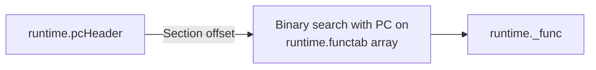
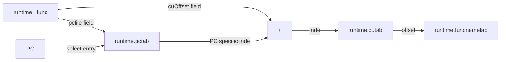
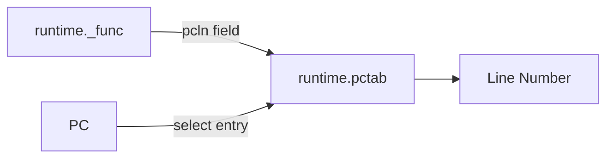
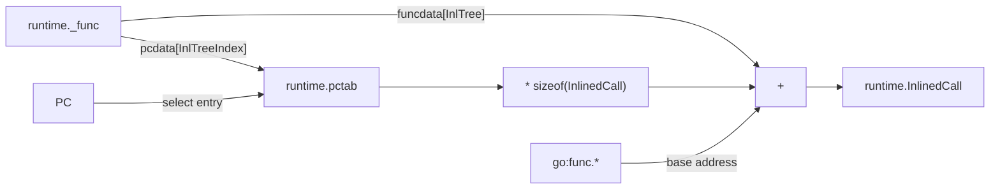

The `gopclntab` format
======================

All Go executables come with additional data sections that provide a plethora of
useful information meant to be used by Go's runtime. The information remains
present even for fully static and stripped executables and is thus very valuable
because it allows us to symbolize and unwind production executables. 

This data is present for all Go target platforms, but this document's scope is
narrowed to Linux ELF executables. The format changed with Go version 1.2, 1.16,
1.18 and 1.20. This document only discusses versions >= 1.16. Some mentions of
details for older versions are made when they are known.

## Reader and writer implementations

Multiple different readers and writers for the `.gopclntab` format exist.

- Readers
  - Go runtime: [`runtime`][runtime]
  - Go standard library: [`debug/gosym`][dbg-gosym]
  - Host agent's elfgopclntab.go
- Writers
  - cgo's linker: [`cmd/link/internal/ld`][cgo-linker]

[cgo-linker]: https://github.com/golang/go/blob/go1.20.6/src/cmd/link/internal/ld/pcln.go
[dbg-gosym]: https://pkg.go.dev/debug/gosym
[runtime]: https://github.com/golang/go/blob/go1.20.6/src/runtime

With the exception of the Go runtime and the linker, none of the other
implementations support parsing inline information. The linker code tends to be
the most readable implementation of the format.

## Data location

The majority of information lives in an ELF section called `.gopclntab`.
Depending on the build process and linker it can also be called
`.data.rel.ro.gopclntab`. Some other information (`go:func:*` and `moduledata`)
are simply mixed into regular data sections. The presence of an ELF section to
mark the location of `.gopclntab` is typical even in stripped executables, but
by no means required. The section can additionally be marked with
`runtime.pclntab`-`runtime.epclntab` `LOCAL` ELF symbols.

Aggressively stripped executables won't have either. A portable alternative that
works regardless of whether the executable is stripped or not is to simply scan
the whole executable for the magic bytes that introduce the gopclntab header.

## Encoding

For the most part the `gopclntab` information uses machine-native encoding for
structs and fields. The Go runtime essentially just creates pointers with Go 
structure types to read the data when it is needed, removing the need for any
decoding/unmarshalling. Any integers are thus stored in the native byte order
of the executable's architecture. Any pointer is sized according to the target
architecture's pointer size.

The following sections use C++ structures and types to represent the data layout
because their field layout and alignment rules are well-defined.

## Header

The `.gopclntab` section starts with 7 bytes whose meaning has remained the same
for all Go versions >= 1.2. They are also encoded the same regardless of target
architecture. The byte order in which the magic is stored is used to infer the
endianness of the executable. The order and offsets of the remaining fields
depend on the magic. All `uintptr` fields are offsets relative to the start of
the `.gopclntab` section.

**Go v1.20 `.gopclntab` header format**
```c++
struct runtime_pcHeader {
  uint32_t magic;            // See "Version" section.
  uint8_t pad[2];            // Zero.
  uint8_t minLC;             // Aka "quantum". Pointer alignment.
  uint8_t ptrSize;           // Pointer size: 4 or 8
  int64_t nfunc;             // Number of entries in the function table.
  unsigned nfiles;           // Number of entries in the file table.
  uintptr_t textStart;       // Base address for text section references.
  uintptr_t funcnameOffset;  // Offset to function name region.
  uintptr_t cuOffset;        // Offset to compilation unit table region.
  uintptr_t filetabOffset;   // Offset to file name region.
  uintptr_t pctabOffset;     // Offset to PC data region.
  uintptr_t pclnOffset;      // Offset to function data region.
};
```

The `textStart` field does not necessarily point to the first byte of the
`.text` section and might be preceded by libc functions. It points to the first
Go generated function.

**Magic version map**

|        Magic | Go version |
|-------------:|------------|
| `0xFFFFFFF1` | 1.20       |
| `0xFFFFFFF0` | 1.18       |
| `0xFFFFFFFA` | 1.16       |
| `0xFFFFFFFB` | 1.2        |

**References**

- https://github.com/golang/go/blob/go1.20.6/src/runtime/symtab.go#L414
- https://github.com/golang/go/blob/go1.20.6/src/cmd/link/internal/ld/pcln.go#L217

## Function table

**Internal name:** `runtime.funcdata`

The function table starts with an `nfunc` sized array of `runtime.functab`
records that map PCs to offsets within the `runtime.funcdata` region. Each such
offset points to a `runtime._func` record.

**Struct that maps PCs to `runtime._func` records (Go >= 1.18)**
```c++
struct runtime_functab {
  uint32_t entryoff; // First byte of function code relative to textStart.
  uint32_t funcoff;  // Offset relative to the function data region start.
}
```

**Struct that maps PCs to `runtime._func` records (Go < 1.18)**
```c++
struct runtime_functab {
  uintptr_t entry;   // First byte of function code. Absolute pointer.
  uintptr_t funcoff; // Offset relative to the function data region start.
};
```

The `runtime._func` struct provides a large amount of information about each
top-level (non-inlined) Go function in the executable. The `pcdata` and
`funcdata` arrays can contain optional additional information. The meaning of
the values are determined by their respective array index.

**Go v1.18+ `runtime._func` structure**
```c++
struct runtime__func {
  uint32_t entryOff;    // First byte of function code relative to textStart.
  int32_t nameOff;      // Function name (runtime.funcnametab offset).
  int32_t args;         // Number of arguments.
  uint32_t deferreturn; // Information about `defer` statements (?).
  uint32_t pcsp;        // PC<->stack delta mappings (runtime.pcdata offset)
  uint32_t pcfile;      // PC<->CU file index mappings (runtime.pcdata offset)
  uint32_t pcln;        // PC<->Line number mappings (runtime.pcdata offset)
  uint32_t npcdata;     // Number of dynamic PC data offsets.
  uint32_t cuOffset;    // Base index of the CU (runtime.cutab index)
  int32_t startLine;    // Line number of the first declaration character (Go v1.20+)
  uint8_t funcID;       // Function ID (only set for certain RT funcs, otherwise 0)
  uint8_t flag;         // Unknown flags.
  uint8_t _[1];         // Padding.
  uint8_t nfuncdata;    // Number of dynamic `go:func.*` offsets.

  // Pseudo-fields (data following immediately after)
  uint32_t pcdata[npcdata]; // `runtime.pcdata` offsets.
  uint32_t funcdata[nfuncdata]; // `go:func.*` offsets (Go >= v1.18).
  uintptr_t funcdata[nfuncdata]; // Absolute pointers (Go < v1.18).
};
```

**Go v1.20 pcdata and funcdata indices**
```go
const (
    PCDATA_UnsafePoint   = 0
    PCDATA_StackMapIndex = 1
    PCDATA_InlTreeIndex  = 2
    PCDATA_ArgLiveIndex  = 3

    FUNCDATA_ArgsPointerMaps    = 0
    FUNCDATA_LocalsPointerMaps  = 1
    FUNCDATA_StackObjects       = 2
    FUNCDATA_InlTree            = 3
    FUNCDATA_OpenCodedDeferInfo = 4
    FUNCDATA_ArgInfo            = 5
    FUNCDATA_ArgLiveInfo        = 6
    FUNCDATA_WrapInfo           = 7
)
```

**References**

- https://github.com/golang/go/blob/go1.16.15/src/runtime/symtab.go#L500
- https://github.com/golang/go/blob/go1.20.6/src/runtime/symtab.go#L582
- https://github.com/golang/go/blob/go1.16.15/src/runtime/runtime2.go#L822
- https://github.com/golang/go/blob/go1.18.10/src/runtime/runtime2.go#L859
- https://github.com/golang/go/blob/go1.20.6/src/runtime/runtime2.go#L882
- https://github.com/golang/go/blob/go1.20.6/src/cmd/link/internal/ld/pcln.go#L541
- https://github.com/golang/go/blob/go1.20.6/src/cmd/link/internal/ld/pcln.go#L616
- https://github.com/golang/go/blob/go1.20.6/src/cmd/link/internal/ld/pcln.go#L637
- https://github.com/golang/go/blob/go1.20.6/src/cmd/internal/objabi/funcdata.go
- https://github.com/golang/go/blob/go1.20.6/src/runtime/symtab.go#L316-L335

## Function name table

**Internal name:** `runtime.funcnametab`

The function name table is a region within `.gopclntab` that stores the names of
all Go functions in the executable.

**Go v1.2 - v1.15**: The table starts with an `nfunc` sized `uint32` array that
maps function indices to offsets relative to the function name table. Each such
offset points to one of the null terminated strings that follow the offset
array.

**Go v1.16+**: The table is a concatenation of null terminated strings.
Function names are no longer referred to by index but by their byte offset in
the function name table.

**References**

- https://github.com/golang/go/blob/go1.20.6/src/cmd/link/internal/ld/pcln.go#L288

## Compilation unit table

**Internal name:** `runtime.cutab`

The compilation unit (CU) table is single big `uint32` array. Each index within
this array is an offset relative to the start of the function name table region.
The array is addressed by adding two indices: one that marks the beginning of a
CU within the larger array and a second one that determines the nth file
associated with that CU.

The CU table was newly added in Go v1.16.

**References**

- https://github.com/golang/go/blob/go1.20.6/src/cmd/link/internal/ld/pcln.go#L447

## PC data table

**Internal name:** `runtime.pctab`

The PC data table is a concatenation of a large amount of PC data "programs"
that, when evaluated, produces a monotonic sequence of 1..n `(pc_offs,
i32_value)` tuples. These sequences are typically used to map program counters
to a value. The PC offsets are relative to `funcdata.entryOff`. The purpose of
`i32_value` is decided by the field that references it. For example the PC
sequence referenced by `runtime._func`'s `pcln` field produces line number
mappings.

PC data sequences are encoded as a repetition of two variable length integers.
The first integer is signed (zig-zag encoding) and specifies the delta to add to
the previous value to compute the next one. The initial value is always -1. The
second field is an unsigned integer that specifies the PC delta to add to the
previous program counter. A value offset of `0` marks the end of a PC sequence.

**Example `pcln` PC data sequence and decoding**
```asm
.gopclntab:A63BE  DCB 0x22   ; val:      0x10
.gopclntab:A63BF  DCB 0x01   ; pc_delta: 0x04
.gopclntab:A63C0  DCB 0x02   ; val:      0x11
.gopclntab:A63C1  DCB 0x01   ; pc_delta: 0x08
.gopclntab:A63C2  DCB 0x02   ; val:      0x12
.gopclntab:A63C3  DCB 0x02   ; pc_delta: 0x10
.gopclntab:A63C4  DCB 0x00   ; <end of sequence>
```

**References**

- https://github.com/golang/go/blob/go1.16.15/src/cmd/internal/objfile/goobj.go#L284

## Module data

**Internal name:** `runtime.firstmoduledata`

`runtime.moduledata` is essentially a bigger version of `runtime.pcHeader`. It
stores all the information that `runtime.pcHeader` has, and more. Go versions >=
1.18 address dynamic function data with offsets relative to the start of the
`go:func.*` region and this offset is not present anywhere else.

Other than the PC header, the module info does not have a canonical, intended
way of locating it. It lives somewhere in the middle of the regular data
sections. An ELF symbol `runtime.firstmoduledata` exists, but it is marked as
`LOCAL` and thus removed during stripping. The struct's layout varies a lot
between different Go versions, though at least it is always the same for all
versions with the same magic.

Fortunately enough, the module data always starts with a pointer to the PC
header. Scanning all data sections for this pointer will always locate the
module data. Thanks to the duplicated information between both structs (e.g.
filetab location) we can perform additional sanity checks to weed out
false-detects. The approach is inspired by what Stephen Eckels describes in his
blog article (see [Further Reading](#further-reading)).

```c++
struct runtime_moduledata {
  runtime_pcHeader *pcHeader;
  slice<uint8_t> funcnametab;
  slice<uint32_t> cutab;
  slice<uint8_t> filetab;
  slice<uint8_t> pctab;
  slice<uint8_t> pclntable;
  slice<runtime_functab> ftab;
  uintptr_t findfunctab;
  uintptr_t minpc;
  uintptr_t maxpc;
  uintptr_t text;
  uintptr_t etext;
  uintptr_t noptrdata;
  uintptr_t enoptrdata;
  uintptr_t data;
  uintptr_t edata;
  uintptr_t bss;
  uintptr_t ebss;
  uintptr_t noptrbss;
  uintptr_t enoptrbss;
  uintptr_t covctrs;
  uintptr_t ecovctrs;
  uintptr_t end;
  uintptr_t gcdata;
  uintptr_t gcbss;
  uintptr_t types;
  uintptr_t etypes;
  uintptr_t rodata;
  uintptr_t gofunc; // <- that's what we need!
  slice<runtime_textsect> textsectmap;
  slice<int32_t> typelinks;
  slice<runtime_itab*> itablinks;
  slice<runtime_ptabEntry> ptab;
  string pluginpath;
  slice<runtime_modulehash> pkghashes;
  string modulename;
  slice<runtime_modulehash> modulehashes;
  uint8_t hasmain;
  runtime_bitvector gcdatamask;
  runtime_bitvector gcbssmask;
  void *typemap;
  bool bad;
  runtime_moduledata *next;
};
```

<details>
  <summary>Definitions for basic runtime types</summary>

```c++
template<typename T>
struct slice {
  T* ptr;
  size_t len;
  size_t cap;
};

struct string {
  uint8_t *str;
  int64_t len;
};

struct runtime_bitvector {
  int32_t n;
  uint8_t *bytedata;
};
```

</details>

**References**

- https://github.com/golang/go/blob/go1.18.10/src/runtime/symtab.go#L415
- https://github.com/golang/go/blob/go1.20.6/src/runtime/symtab.go#L434

## Inline instance information

Inline information is obtained by reading `runtime._func.funcdata[FUNCDATA_InlTree]`
to locate the base offset of the inline tree for the function and then using the
`runtime._func.pcdata[PCDATA_InlTreeIndex]` PC data sequence to locate the correct
index within that inline tree for any given PC in the function. This index is 
then multiplied by the size of the `runtime.inlinedCall` structure and added to the
base offset to produce the address of the `inlinedCall` instance for any given PC.

**Go v1.16 - v1.18 `runtime.inlinedCall` structure**
```c++
struct runtime_inlinedCall {
  int16_t parent;
  uint8_t funcID;
  uint8_t _;
  int32_t file;
  int32_t line;
  int32_t func_;
  int32_t parentPc;
};
```

**Go v1.20+ `runtime.inlinedCall` structure**
```c++
struct runtime_inlinedCall {
  uint8_t funcID;
  uint8_t _[3];
  int32_t nameOff;
  int32_t parentPc;
  int32_t startLine;
};
```

**References**

- https://github.com/golang/go/blob/go1.18.10/src/runtime/symtab.go#L1172
- https://github.com/golang/go/blob/go1.20.6/src/runtime/symtab.go#L1208

## Lookup paths

This section provides some examples on what structures need to be traversed to
locate various function information. This omits details like relative offsets
that depend on data from the header or moduledata to keep complexity manageable.

### Locating `runtime._func` for a PC


### Resolving file names for a function



### Resolving line numbers



### Resolving inline information



## Further Reading

- https://www.mandiant.com/resources/blog/golang-internals-symbol-recovery
- https://docs.google.com/document/d/1lyPIbmsYbXnpNj57a261hgOYVpNRcgydurVQIyZOz_o/pub
