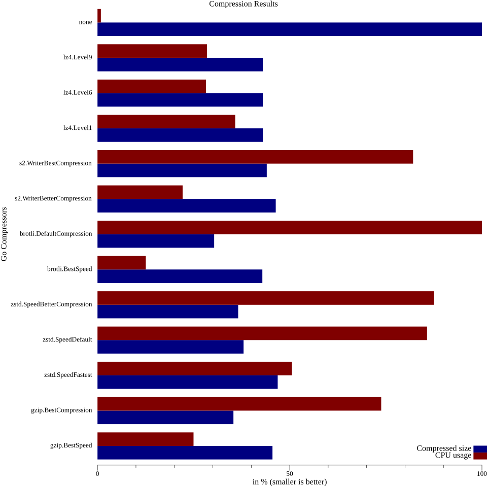

The idea is to record the wire messages of the profiling agent and see how well they compress using different
compressors and what the CPU impact is.

To record the wire messages, you need to run the profiling agent with the `-bench-proto-dir` flag.
This will write the wire messages into the given directory. The directory will be created if it does not exist.

You can then use the `protobench` tool to compress the wire messages and see how well they compress and how much
CPU time it takes to compress them.

To run the profiling agent, first have a receiving endpoint, e.g. `devfiler` listening on localhost:11000.
Then run the profiling agent with the `-bench-proto-dir` flag:
```shell
sudo ./opentelemetry-ebpf-profiler -bench-proto-dir=/tmp/protobuf -collection-agent=127.0.0.1:11000 -disable-tls
```
The wire messages are written to `protobuf/`, one file per message.

To compress the wire messages and generate a bar chart, run the `protobench` tool:
```shell
cd tools/protobench
go run ./... -bench-proto-dir=/tmp/protobuf -output-file=results.png
```
If you don't see any errors, the tool will generate a PNG file with a bar chart showing the compression ratio and
compression time for each compressor.
The extension `.csv` can be used to generate a CSV file with the raw data instead of a PNG file.
No `-output-file` flag will display the results in the terminal.

Of course, you can also use the `protobench` tool to compare compression of any other files.

### Example PNG output


